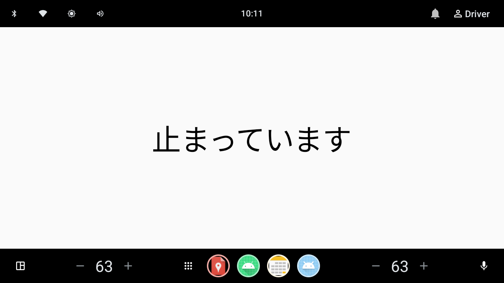
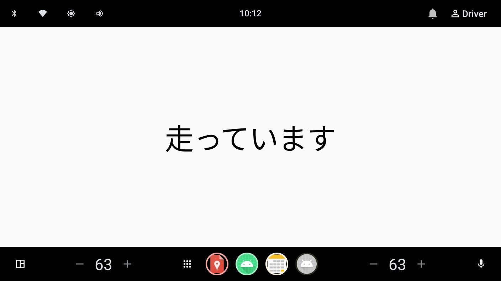
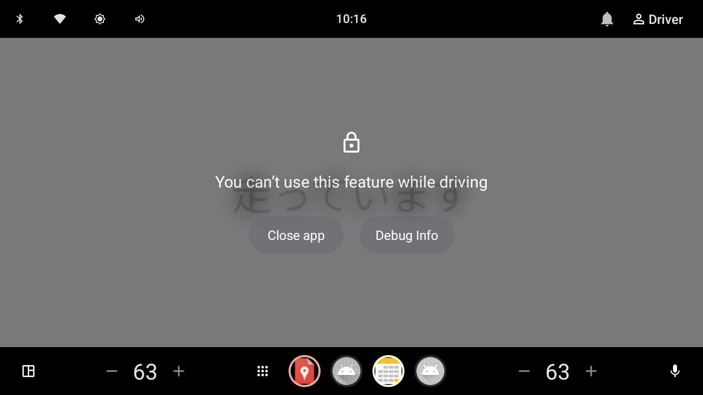

# AAOS の「走行中はここまで」を、実機なしで adb だけで再現する

## はじめに

車が走り出した瞬間にアプリの画面が切り替わる、あの挙動を自分のアプリで再現したいと思ったことはないだろうか。
実車もドライブシミュレータも要らない。AAOS Emulator に adb で VHAL イベントを流し込むだけで、速度もギアも思いのままに偽装できる。
本記事は「速度を10にしたら画面が『走っています』に変わる」ところまでを、コードとコマンドの実物付きで最短距離でたどる。

## 結論（ここだけ読めば分かること）

- **車両状態の判定は速度値を直接見ず、`CarUxRestrictionsManager` の `UX_RESTRICTIONS_NO_VIDEO` を監視する。** これが動画アプリなど実車向け制御の定石で、AAOS が速度・ギアから算出した「今どこまで許すか」をそのまま使える。
- **テストは実機不要。** `adb shell dumpsys activity service com.android.car inject-vhal-event <property> <value>` で速度・ギアを注入すれば、アプリの表示が切り替わることを Emulator 上で確認できる。
- **ハマりどころは2つ。** ①速度を0にしても `NO_VIDEO` が解除されないことがある（ギアを Park にする必要がある）。②走行中に自前画面を出すには Manifest の `distractionOptimized` 宣言が要る。この宣言は「アプリが動くか」ではなく「AAOS のブロック画面で覆われるか」を決めるフラグである。

以下、作ったサンプルと検証の記録。

## 作ったもの

画面中央に大きな文字を出すだけの AAOS アプリ。車両状態に応じて表示だけを切り替える。

- `UX_RESTRICTIONS_NO_VIDEO` が有効 → **走っています**
- 無効 → **止まっています**

これだけ。ロジックは Activity 1つに収まる。

| 停止中 | 走行中 |
|---|---|
|  |  |

## 実装のキモ: なぜ速度値を直接見ないのか

`CarPropertyManager` で `PERF_VEHICLE_SPEED` を読んで「0より大きければ走行」と判定することもできる。だがそれは筋が悪い。実車の「走行中は動画を出すな」というルールは、速度だけでなくギア・パーキングブレーキ・地域の法規まで含めて AAOS 側が算出している。アプリがそのロジックを再実装するのは車輪の再発明で、しかも法規変更に追従できない。

代わりに `CarUxRestrictionsManager` を監視する。AAOS が算出済みの「UX 制限」を受け取るだけでよい。動画アプリなら `UX_RESTRICTIONS_NO_VIDEO` ビットが立っているかどうかを見れば「今、映像を出していい状態か」が分かる。

接続とライフサイクルはこうなる。`Car.createCar()` で Car API に繋ぎ、`CAR_UX_RESTRICTION_SERVICE` からマネージャを取得。画面表示中だけリスナを登録し、破棄時に解除・切断してリークを防ぐ。

```kotlin
class MainActivity : ComponentActivity() {

    private var car: Car? = null
    private var uxManager: CarUxRestrictionsManager? = null
    private var moving by mutableStateOf(false)

    private val listener = CarUxRestrictionsManager.OnUxRestrictionsChangedListener { r ->
        applyRestrictions(r)
    }

    override fun onCreate(savedInstanceState: Bundle?) {
        super.onCreate(savedInstanceState)
        car = Car.createCar(this)
        uxManager = car?.getCarManager(Car.CAR_UX_RESTRICTION_SERVICE) as? CarUxRestrictionsManager

        setContent {
            WebViewOnAndroid14Theme {
                Box(Modifier.fillMaxSize(), contentAlignment = Alignment.Center) {
                    Text(
                        text = if (moving) "走っています" else "止まっています",
                        style = MaterialTheme.typography.displayLarge
                    )
                }
            }
        }
    }

    override fun onStart() {
        super.onStart()
        val m = uxManager ?: return
        m.registerListener(listener)
        applyRestrictions(m.currentCarUxRestrictions) // 初期表示を反映
    }

    override fun onStop() {
        super.onStop()
        uxManager?.unregisterListener()
    }

    override fun onDestroy() {
        super.onDestroy()
        car?.disconnect()
        car = null
    }

    private fun applyRestrictions(r: CarUxRestrictions?) {
        val active = r?.activeRestrictions ?: 0
        moving = active and CarUxRestrictions.UX_RESTRICTIONS_NO_VIDEO != 0
        Log.d(TAG, "activeRestrictions=0x${active.toString(16)}, moving=$moving")
    }
}
```

ビルド設定で忘れがちなのが2点。`android.car` はシステム API なので `build.gradle.kts` の `android {}` に `useLibrary("android.car")` が要る。そして Manifest には AAOS 専用であることを示す `uses-feature android.hardware.type.automotive`（required）を入れる。UX 制限の *読み取り* に追加パーミッションは不要だった。

## adb でのテスト: 実機なしで車を「走らせる」

肝はこのコマンド。`inject-vhal-event` で VHAL のプロパティに任意の値を書き込む。

```bash
# 速度 PERF_VEHICLE_SPEED = 0x11600207
adb shell dumpsys activity service com.android.car inject-vhal-event 0x11600207 10   # 走行相当
adb shell dumpsys activity service com.android.car inject-vhal-event 0x11600207 0    # 停止相当
```

アプリのログを見ると、状態がそのまま反映されている。

```
D VehicleStateDemo: activeRestrictions=0xff, moving=true
D VehicleStateDemo: activeRestrictions=0x0,  moving=false
```

`0x10` が `UX_RESTRICTIONS_NO_VIDEO`、`0xff` は全制限が立った状態、`0x0` は制限なし。ビット演算で `NO_VIDEO` を拾えているのが確認できる。

## ハマりどころ①: 速度0だけでは「止まっています」にならない

速度に0を注入しても `NO_VIDEO` が解除されず、「走っています」のまま、ということが起きる。AAOS の Driving State は速度だけでなくギアにも依存するためだ。停止として扱わせるには、ギアも Park にする必要がある。

```bash
# ギア GEAR_SELECTION = 0x11400400 / VehicleGear.GEAR_PARK = 4, GEAR_DRIVE = 8
adb shell dumpsys activity service com.android.car inject-vhal-event 0x11400400 8   # Drive
adb shell dumpsys activity service com.android.car inject-vhal-event 0x11400400 4   # Park
```

「Drive + 速度10」で `0xff`（走行）、「Park + 速度0」で `0x0`（停止）にきれいに落ちた。プロパティ ID やギアの値は Emulator イメージで異なることがあるので、迷ったら `adb shell dumpsys activity service com.android.car | grep -i gear` で確認する。

## ハマりどころ②: distractionOptimized は「動くか」ではなく「覆われるか」

最初、走行状態にしたら自作の「走っています」ではなく、AAOS 標準の **"You can't use this feature while driving"** というブロック画面が出た。だがログは `moving=true` を吐き続けている。つまりアプリは裏で動いていて、AAOS が上から覆っているだけだった。

これは、アプリが「走行中に表示してよい画面」だと宣言していないための標準動作。Manifest の Activity に次を足すと解決する。

```xml
<meta-data
    android:name="distractionOptimized"
    android:value="true" />
```

`true`/`false` を切り替えて比べると挙動の意味がはっきりする。

| | 走行中の表示 | ログ |
|---|---|---|
| `distractionOptimized=true` | 「走っています」（自前画面） | `moving=true` |
| `distractionOptimized=false` | AAOS ブロック画面（裏に自前画面が透ける） | `moving=true` |

`false` のスクリーンショットではブロック画面の背後に「走っています」がうっすら透けて見えた。アプリは常に動いていて、表示だけが覆われる——という関係がそのまま可視化された形だ。



つまり `distractionOptimized` は「走行中にアプリを動かすか」ではなく、**「走行中に自前 UI を出す責任を開発者が負う（＝運転者気を散らさないガイドラインの順守を約束する）か」を宣言するフラグ**。中身が本当に安全かを OS はチェックしないし、量産車では OEM のホワイトリスト登録も別途必要になる。注意点として、Manifest の変更はコード修正と違い再インストール（`installDebug`）しないと反映されない。

## 小ネタ: Emulator の screencap がマルチディスプレイで壊れる

車載 Emulator は複数ディスプレイを持つため、`adb exec-out screencap -p` の出力先頭に `[Warning] Multiple displays...` という警告文字列が混ざり、PNG として壊れる。PNG のマジックバイト以降だけを取り出せば救える。

```bash
adb exec-out screencap -p > raw.bin
python3 -c 'import sys;d=open("raw.bin","rb").read();i=d.find(b"\x89PNG\r\n\x1a\n");open("shot.png","wb").write(d[i:])'
```

## まとめ

- 車両状態による表示制御は、速度を自前判定せず `CarUxRestrictionsManager` に委ねるのが筋がよい。
- `adb ... inject-vhal-event` で速度もギアも偽装でき、実機なしで挙動を検証できる。
- `NO_VIDEO` を消すにはギア Park まで含める。走行中に自前画面を出すには `distractionOptimized` を宣言する。この2つを押さえれば、AAOS の「走行中の振る舞い」は手元の Emulator で一通り再現・テストできる。
